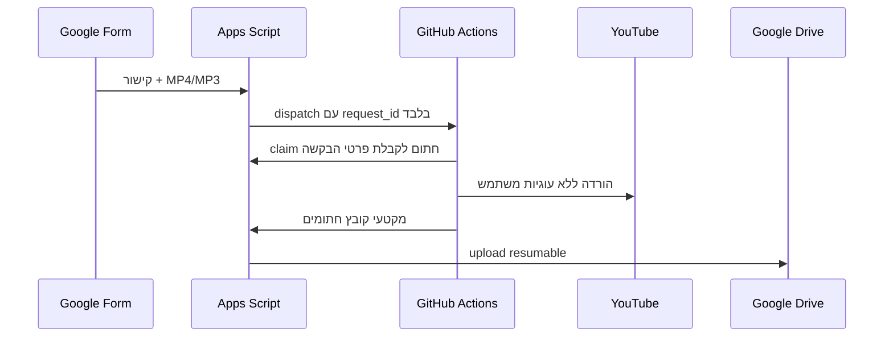

# Draive — Google Forms to Drive downloads

Draive מחבר טופס Google Forms אל Google Apps Script ואל GitHub Actions: המשתמש שולח קישור YouTube בטופס, Apps Script פותח בקשת עבודה, GitHub Actions מוריד קובץ ציבורי בלי עוגיות חשבון, והקובץ חוזר דרך Apps Script אל תיקיית Google Drive שלך.

המאגר בנוי כך שה־URL של הסרטון לא נשלח כ־input גלוי ל־GitHub Actions. ה־Workflow מקבל רק מזהה בקשה, ואז מושך את פרטי הבקשה מ־Apps Script ב־RPC חתום. גם אסימון OAuth של Google וגם כתובת ההעלאה הזמנית של Drive נשארים ב־Apps Script בלבד.

## מגבלות חשובות

- המימוש לא משתמש בעוגיות משתמש, `cookies.txt`, התחברות לחשבון YouTube או דפדפן מחובר. סרטונים ציבוריים רבים יכולים לעבוד כך, אבל YouTube עשוי לדרוש התחברות, אימות או PO token לסרטון מסוים או לאזור מסוים. במצב כזה הבקשה תיכשל עם הודעה מתאימה בגיליון.
- GitHub Actions מתאים כאן לבדיקת אינטגרציה ולשימוש קל. לפי תנאי GitHub, אין להשתמש ב־Actions כתחליף קבוע לשרת הורדות או CDN. רכיב ה־Python נמצא ב־`worker/` ויכול לרוץ גם על שרת רגיל עם אותם משתני סביבה.
- ברירת המחדל מגבילה כל קובץ ל־200MB, כל סרטון ל־60 דקות, עד 3 בקשות פעילות ועד 20 בקשות ביום. אפשר לשנות את הערכים ב־Script Properties.
- Apps Script ו־Drive עובדים במקטעי העלאה של 1MiB כדי לא להיתקל במגבלות תגובת HTTP של Apps Script.

## מה יש במאגר

| נתיב | תפקיד |
|---|---|
| `apps-script/Code.gs` | קוד Apps Script: טופס, גיליון מעקב, Web App חתום, העלאה resumable ל־Drive |
| `apps-script/appsscript.json` | manifest עם scopes ו־Drive API מתקדם |
| `worker/main.py` | worker שמוריד בעזרת `yt-dlp`, שולח מקטעים חתומים ל־Apps Script, ומדווח תקלות |
| `.github/workflows/download.yml` | Workflow שמריץ בקשת הורדה לפי `request_id` |
| `.github/workflows/test.yml` | בדיקות מקומיות ל־Python ול־Apps Script |
| `tests/` | בדיקות אבטחה ופרוטוקול בלי צורך בסודות |

## זרימת העבודה



## התקנה ב־Google Apps Script

1. פתח פרויקט Apps Script חדש או קיים.
2. העתק את `apps-script/Code.gs` אל קובץ קוד בפרויקט.
3. העתק את `apps-script/appsscript.json` אל קובץ ה־manifest. אם כבר יש לך manifest, אחד את ה־scopes ואת `enabledAdvancedServices` במקום למחוק הגדרות קיימות.
4. ב־Google Cloud של הפרויקט ודא ש־Google Drive API מופעל. גם ב־Apps Script, תחת Services, הוסף את השירות המתקדם Drive API v3.
5. הרץ את `setupDraive` מתוך העורך. ההרצה תיצור אם חסר:
   - תיקיית Drive בשם `Draive downloads`
   - גיליון מעקב בשם `Draive — מעקב הורדות`
   - טופס בשם `בקשת הורדה לדרייב`
   - trigger לטופס ו־trigger תחזוקה שעתי
   - סוד `CALLBACK_SECRET` בתוך Script Properties
6. בדוק ב־Executions או בלוגים את הקישורים שנוצרו לטופס, לגיליון ולתיקייה.

אם יש לך כבר טופס או גיליון, אפשר להגדיר מראש את המפתחות האלה ב־Script Properties לפני `setupDraive`:

| מפתח | ערך |
|---|---|
| `FORM_ID` | מזהה טופס קיים |
| `SPREADSHEET_ID` | מזהה גיליון מעקב קיים |
| `DRIVE_FOLDER_ID` | מזהה תיקיית יעד קיימת |
| `FORM_URL_FIELD` | שם השדה בטופס שמכיל קישור YouTube |
| `FORM_FORMAT_FIELD` | שם שדה הבחירה ל־MP4/MP3 |

## פריסה כ־Web App

פרוס את Apps Script כ־Web App:

- Execute as: **Me**
- Who has access: **Anyone**

הגישה האנונימית אינה נותנת גישה חופשית לשירות. כל פעולה שמבצעת עבודה דורשת HMAC עם `CALLBACK_SECRET`. אחרי הפריסה שמור את כתובת ה־`/exec`; היא תהיה הערך של `APPS_SCRIPT_URL` ב־GitHub Secrets.

בכל שינוי בקוד Apps Script צריך לפרוס גרסה חדשה של ה־Web App אם אתה משתמש ב־deployment versioned.

## הגדרת GitHub

ב־Apps Script, ב־Script Properties, הגדר:

| מפתח | ערך מומלץ |
|---|---|
| `GITHUB_OWNER` | `novabyte2026` |
| `GITHUB_REPO` | `draive` |
| `GITHUB_REF` | `main` |
| `GITHUB_WORKFLOW` | `download.yml` |
| `GITHUB_TOKEN` | Fine-grained personal access token עם הרשאת **Actions: Read and write** למאגר הזה |

ב־GitHub, תחת `Settings → Secrets and variables → Actions`, צור שני secrets:

| Secret | ערך |
|---|---|
| `APPS_SCRIPT_URL` | כתובת ה־Web App שמסתיימת ב־`/exec` |
| `CALLBACK_SECRET` | אותו ערך שנמצא ב־Script Properties תחת `CALLBACK_SECRET` |

אל תשים את `GITHUB_TOKEN`, `CALLBACK_SECRET`, כתובת העלאת Drive או OAuth token בקוד או בגיליון ציבורי.

## שימוש

אחרי ההתקנה:

1. פתח את טופס Google Forms שנוצר.
2. שלח קישור לסרטון YouTube ציבורי ובחר MP4 או MP3.
3. עקוב בגיליון `בקשות Draive` אחרי מצב הבקשה.
4. כשהבקשה מסתיימת, קישור הקובץ יופיע בגיליון.

אפשר גם לקרוא מתוך Apps Script קיים:

```javascript
function myExistingHandler() {
  const requestId = submitDraiveRequest('https://www.youtube.com/watch?v=ABCDEFGHI01', 'MP4', 'external-id-123');
  console.log(requestId);
}
```

`sourceId` נועד למנוע כפילות אם אותו אירוע נשלח שוב.

## הרצה בלי GitHub Actions

אם תרצה להריץ את רכיב ההורדה על שרת רגיל, הגדר ב־Script Properties:

```text
EXECUTION_MODE=manual
```

במצב הזה הטופס ייצור בקשה בגיליון אך לא יפעיל GitHub. על השרת מריצים את worker עם מזהה הבקשה:

```bash
python -m pip install -r requirements.txt
export APPS_SCRIPT_URL='https://script.google.com/macros/s/.../exec'
export CALLBACK_SECRET='...'
export REQUEST_ID='00000000-0000-0000-0000-000000000000'
python -m worker.main
```

## הודעות שגיאה נפוצות

| קוד | משמעות |
|---|---|
| `YOUTUBE_AUTH_REQUIRED` | הסרטון דורש התחברות או אימות ולכן אינו זמין בלי עוגיות |
| `YOUTUBE_BLOCKED` / `YOUTUBE_RATE_LIMIT` | YouTube חסם או הגביל זמנית את השרת |
| `DISPATCH_FAILED` | Apps Script לא הצליח להפעיל את ה־Workflow; בדוק `GITHUB_TOKEN` והרשאת Actions |
| `CALLBACK_ACCESS` | כתובת ה־Web App או הרשאות הפריסה אינן נכונות |
| `DRIVE_ERROR` | בעיית Drive API, הרשאות, תיקייה או מקום פנוי |
| `STALE` | לא התקבל עדכון במשך שעתיים; בדוק את לשונית Actions |
| `CHECKSUM_MISMATCH` | Drive החזיר קובץ שגודלו או ה־MD5 שלו אינם תואמים |

## בדיקות פיתוח

מהשורש של המאגר:

```bash
python -m unittest discover -s tests -p 'test_*.py'
node --test tests/apps-script.test.cjs
```

הבדיקות לא מפעילות YouTube, Drive או GitHub אמיתיים. הן בודקות את צורת החתימה, הגבלת URL, claim fencing, עדכון גיליון אחרי מיון, והעלאת chunks ברמת הפרוטוקול.

## מקורות רשמיים שנבדקו בזמן הבנייה

- [GitHub Actions workflow_dispatch](https://docs.github.com/en/actions/using-workflows/events-that-trigger-workflows#workflow_dispatch)
- [GitHub terms for Actions](https://docs.github.com/en/site-policy/github-terms/github-terms-for-additional-products-and-features#actions)
- [Apps Script quotas](https://developers.google.com/apps-script/guides/services/quotas)
- [Drive API resumable uploads](https://developers.google.com/workspace/drive/api/guides/manage-uploads)
- [yt-dlp YouTube extractor notes](https://github.com/yt-dlp/yt-dlp/wiki/Extractors)
- [yt-dlp external JavaScript runtime support](https://github.com/yt-dlp/yt-dlp/wiki/EJS)
